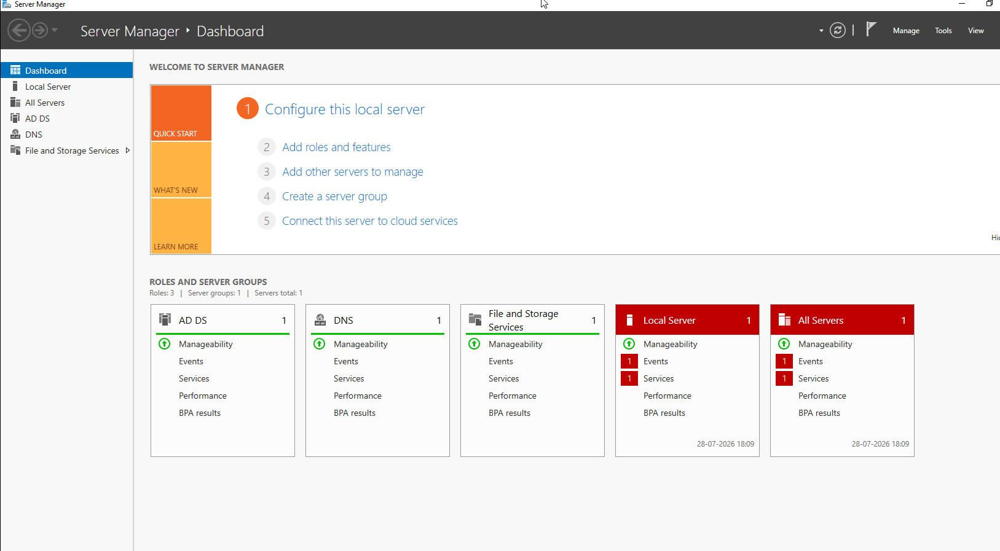
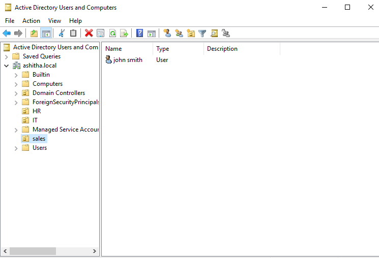

# 01 - Active Directory Setup

## What I Built

I set up a Windows Server 2019 VM and configured it as a Domain Controller for a new Active Directory forest (`ashithalab.local`). I created an Organizational Unit (OU) structure with four departments — Sales, IT, HR, and Management — and added test users inside each OU to simulate a real company directory.

## Steps Taken

1. Installed the **Active Directory Domain Services (AD DS)** role via Server Manager.
2. Promoted the server to a **Domain Controller**, creating a new forest with root domain `ashithalab.local`.
3. Set a DSRM (Directory Services Restore Mode) password for disaster recovery scenarios.
4. After restart, logged in as `ASHITHALAB\Administrator` to confirm the domain was active.
5. Created 4 **Organizational Units** in Active Directory Users and Computers (ADUC): Sales, IT, HR, Management.
6. Created 2-3 test users inside each OU (e.g. `john.sales`, `priya.it`) to simulate department-level user accounts.

## Why Each Step Matters

- **AD DS role**: This is the core Windows service that provides directory, authentication, and policy management for a network. Without it, there's no AD to configure.
- **Promoting to a DC**: Turns a plain Windows Server into the authoritative source of identity for the domain — every computer/user that joins `ashithalab.local` will authenticate against this server.
- **New forest vs. joining an existing one**: A new forest was needed since this is a fresh, standalone lab environment (no existing AD infrastructure to join).
- **OUs (Organizational Units)**: OUs let admins apply different Group Policies, permissions, and delegated control to different parts of an organization. Real companies structure OUs by department, location, or function — this mirrors that.
- **Test users per OU**: Demonstrates that user accounts can be organized and managed per-department, which is the foundation for later labs (Group Policy, permissions, password policies).

## Screenshots

### AD DS Role Installed

### ADUC - OU Structure with Test Users

### Domain Login Confirmation

## Skills Demonstrated

- Windows Server role installation and configuration
- Active Directory forest/domain design
- OU structure planning for organizational hierarchy
- User account provisioning
