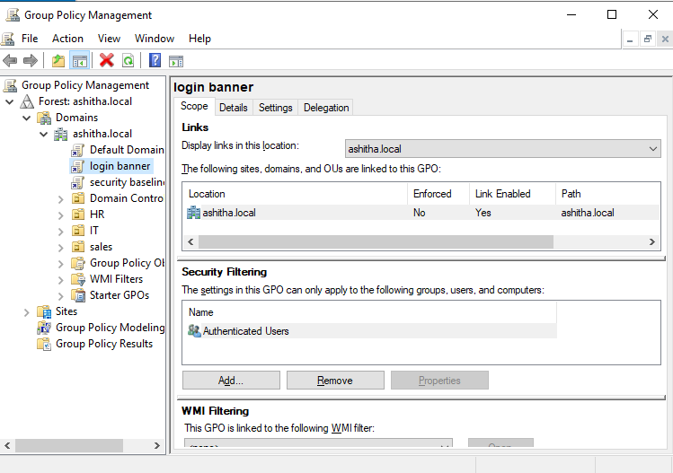
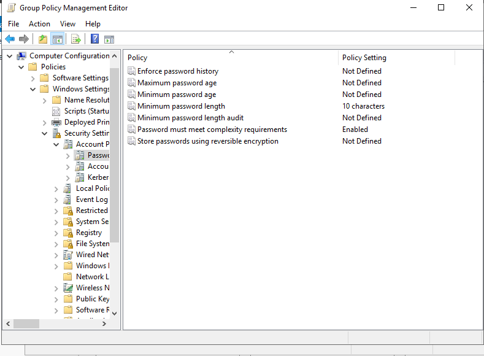
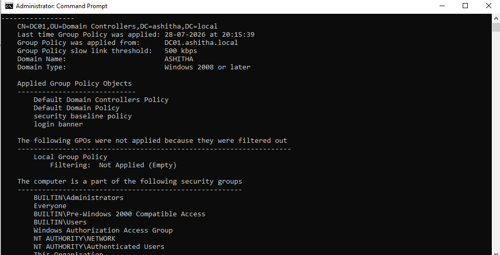

# 02 - Group Policy Configuration

## What I Built

I created and applied two Group Policy Objects (GPOs) at the domain level in `ashitha.local` to enforce basic security hardening: a password/account lockout baseline, and a login warning banner. This simulates how real organizations use Group Policy to push consistent security settings to every machine in the domain from a single, centralized location.

## Steps Taken

1. Created a GPO named **"Security Baseline Policy"** and linked it to the domain.
2. Configured **Account Policies** inside it:
   - Minimum password length: **10 characters**
   - Password complexity: **Enabled**
   - Account lockout threshold: **5 invalid attempts**
   - Account lockout duration: **15 minutes**
3. Created a second GPO named **"Login Banner"** and linked it to the domain.
4. Configured the **Interactive logon message** to display: *"Authorized users only. Activity is monitored."*
5. Ran `gpupdate /force` to immediately push both policies to the server.
6. Ran `gpresult /r` to confirm both GPOs were successfully applied.

## Why Each Policy Matters

- **Minimum password length (10 characters)**: Longer passwords are exponentially harder to brute-force or crack offline. This is one of the simplest, highest-impact security controls an org can enforce.
- **Password complexity enabled**: Forces a mix of uppercase, lowercase, numbers, and symbols — this blocks common weak passwords (e.g. `password1`) that appear in most breach/dictionary lists.
- **Account lockout threshold (5 attempts)**: Directly defends against brute-force and password-spray attacks by locking the account before an attacker can try enough combinations to succeed.
- **Account lockout duration (15 minutes)**: Balances security with usability — long enough to slow down automated attacks, short enough that a legitimate user isn't locked out indefinitely or forced to call IT every time.
- **Login banner**: This isn't just cosmetic — in many organizations it has legal significance. It formally notifies anyone accessing the system that activity is monitored, which supports the organization's ability to take action (including legal) against unauthorized access, since the user was explicitly warned.
- **Applying via GPO at the domain level**: Instead of configuring these settings on every machine one by one, GPOs let a single policy centrally enforce these rules across every computer/user in the domain — this is the core efficiency and consistency benefit of Active Directory in a real enterprise.

## Screenshots

### GPOs Linked to Domain

### Password Policy Settings

### gpresult /r Confirmation

## Skills Demonstrated

- Group Policy Object (GPO) creation and domain-level linking
- Windows account security hardening (password + lockout policies)
- Security/legal-notice banner configuration
- Policy verification using `gpupdate` and `gpresult`
