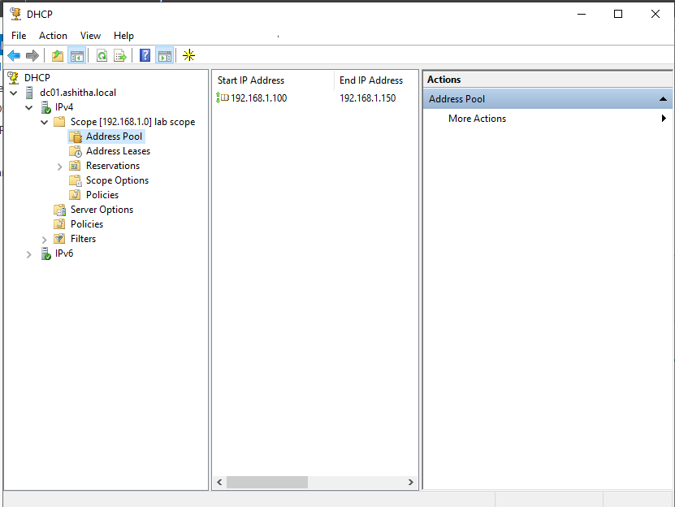
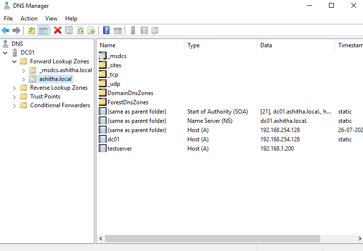

# 03 - DNS & DHCP Configuration

## What I Built

I installed and configured the DHCP Server role on my domain controller, created a DHCP scope to hand out IP addresses to client devices, and added a test DNS record in the existing Active Directory-integrated DNS zone. This simulates how a real network automatically assigns IPs and resolves hostnames within a domain.

## Steps Taken

1. Installed the **DHCP Server role** via Server Manager.
2. Completed **post-install configuration**, which authorizes the DHCP server in Active Directory — required before it's allowed to hand out IPs on the domain network.
3. Created a new DHCP scope named **LabScope**:
   - IP range: `192.168.1.100` – `192.168.1.150`
   - Subnet mask: `255.255.255.0`
   - Default gateway: `192.168.1.1`
   - DNS server: pointed to the domain controller's IP
   - Activated the scope so it can start leasing addresses.
4. Verified the **Forward Lookup Zone** (`ashitha.local`) in DNS Manager, confirming the domain controller's own A record was already present (created automatically during AD setup).
5. Created a test **A record**: `testserver` → `192.168.1.200`.

## Why This Matters

- **DHCP Server role**: Without DHCP, every device on a network would need a manually configured IP address — impractical beyond a handful of machines. DHCP automates this, reducing configuration errors and admin overhead.
- **Authorizing DHCP in AD**: Windows domains require DHCP servers to be authorized in Active Directory before they can lease IPs. This prevents unauthorized/rogue DHCP servers from being added to the network and handing out incorrect or malicious network settings — a real attack technique (DHCP spoofing) that this authorization step defends against.
- **DHCP Scope**: A scope defines the range of IPs available to hand out, along with related settings (gateway, DNS) that every client receives automatically. This ensures every device that joins the network gets consistent, correct configuration without manual setup.
- **DNS Forward Lookup Zone**: Translates hostnames into IP addresses (e.g. `testserver` → `192.168.1.200`), which is what allows users and applications to reach systems by name instead of memorizing IP addresses — essential for how domain services, file shares, and applications locate each other.
- **A Records**: Each A record maps one hostname to one IP. In a real environment, every server/service that needs to be reachable by name (file servers, web apps, mail servers) requires an A record like this.

## A Note on PTR Records

While creating the test A record, DNS Manager displayed a warning that the associated PTR (pointer) record could not be created, since no Reverse Lookup Zone existed. This is expected — only a Forward Lookup Zone was required for this lab. In a production environment, a Reverse Lookup Zone would typically also be configured to support reverse DNS queries (IP → hostname), which is useful for network troubleshooting and required by some security and logging tools.

## Screenshots

### DHCP Scope Active

### DNS A Record Created

## Skills Demonstrated

- DHCP server installation, authorization, and scope configuration
- Understanding of DHCP security considerations (rogue server prevention)
- DNS zone verification and manual record creation
- Practical understanding of forward vs. reverse DNS resolution
