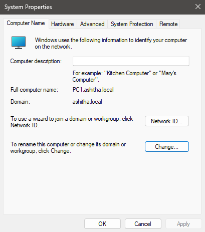
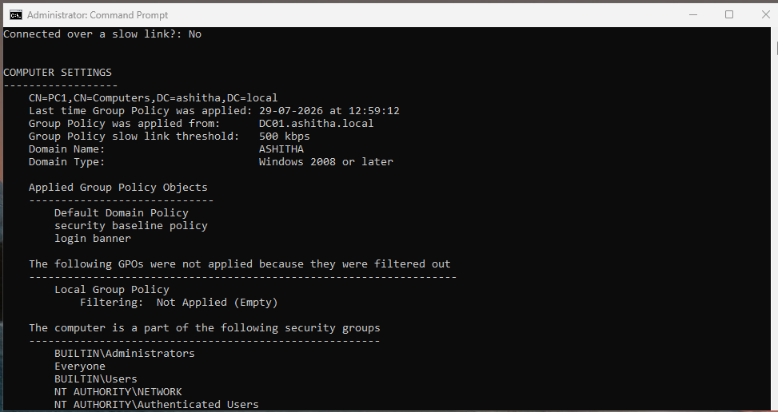
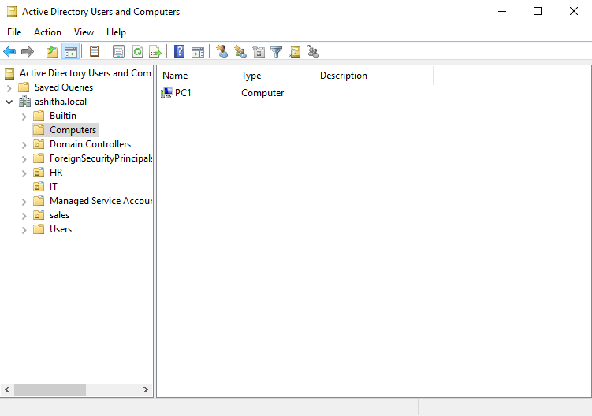

# 04 - Domain Join & GPO Verification

## What I Built

I joined a Windows 10 client (`PC1`) to the `ashitha.local` domain, logged in with a domain user account, and verified end-to-end that Group Policy Objects created earlier (Security Baseline Policy and Login Banner) apply correctly to a domain-joined client. This proves the full chain: server → domain → client joined → GPO enforced.

## Steps Taken

1. Joined the Windows 10 VM to the domain via **System Properties → Change → Domain**, entering `ashitha.local` and domain admin credentials.
2. Confirmed the join succeeded — full computer name shows as `PC1.ashitha.local`, domain shows as `ashitha.local`.
3. Logged in with a domain user account (`jdoe`, part of the IT OU).
4. Ran `gpresult /r` to confirm GPO application. Under **Computer Settings → Applied Group Policy Objects**, both **Security Baseline Policy** and **Login Banner** appeared, alongside the built-in **Default Domain Policy**.
5. Verified in Active Directory Users and Computers (on the server) that the client computer object **PC1** automatically appeared in the **Computers** container after the domain join.

## Why This Matters

- **Domain join**: This is what transforms a standalone PC into a managed client under centralized IT control — authentication, policy, and security settings are now enforced by the domain rather than configured locally on each machine.
- **Domain user login**: Confirms that credentials are validated against the domain controller (not a local account), proving the authentication chain between client and DC works correctly.
- **gpresult verification**: This is the standard real-world tool admins use to confirm policy actually reached a machine — critical for troubleshooting when a user reports "my settings aren't right," since it shows exactly which GPOs are applied, filtered, or denied, and why.
- **Computer object in ADUC**: Confirms the domain controller is tracking this device as a managed asset, which is required for it to receive future GPOs, updates, and be visible to IT administration and security monitoring tools.

## A Note on the Login Banner

While the **Security Baseline Policy** and **Login Banner** GPOs were both confirmed applying via `gpresult` (visible under Computer Settings → Applied Group Policy Objects), the login banner text did not visibly render on this client. Investigation via the client registry (`HKLM\SOFTWARE\Microsoft\Windows\CurrentVersion\Policies\System`) showed the expected `legalnoticetext` value was never created, despite the GPO showing as linked and applied — pointing to a client-side policy processing gap rather than a misconfigured GPO. This is a good example of the difference between a GPO showing as "applied" in `gpresult` versus every individual setting inside it actually taking effect on the client, and highlights why registry-level verification is sometimes necessary beyond just checking `gpresult` output.

## Screenshots

### System Properties Showing Domain Join

### gpresult Confirming GPOs Applied

### ADUC Showing PC1 Computer Object

## Skills Demonstrated

- Domain join process for Windows client machines
- Domain user authentication verification
- Group Policy verification and troubleshooting using `gpresult`
- Registry-level diagnostics for policy application issues
- Understanding of the distinction between GPO linkage and individual setting enforcement
