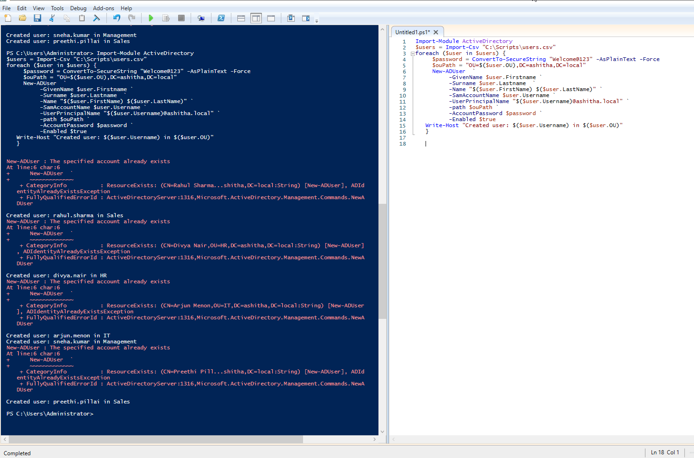

# 05 - PowerShell Bulk User Creation

## What I Built

I wrote a PowerShell script to automate bulk creation of Active Directory user accounts from a CSV file, rather than creating each user manually through ADUC. The script reads a list of users (name, username, target department) and creates each one in the correct Organizational Unit, using `New-ADUser`.

## Steps Taken

1. Created a CSV file (`users.csv`) listing 5 sample users, each with First Name, Last Name, Username, and target OU (Sales, HR, IT, Management).
2. Wrote a PowerShell script that:
   - Imports the CSV into a PowerShell object using `Import-Csv`.
   - Loops through each row with `foreach`.
   - Builds the correct OU path dynamically based on each user's department.
   - Creates each user account with `New-ADUser`, setting name, username, UPN, target OU, a default password, and enabling the account.
   - Prints a confirmation line for each user processed.
3. Ran the script in PowerShell ISE and verified in ADUC that all 5 users appeared in their correct OUs.

## Debugging Along the Way

This lab surfaced two real issues that took actual troubleshooting to resolve, which I think is worth documenting rather than hiding:

- **Variable scope bug**: My first draft used `$users` (the whole imported list) instead of `$user` (the current person being processed) in a couple of spots — including the line that builds the OU path. This caused `New-ADUser` to fail with `"Directory object not found"` for the affected user, since the OU path ended up malformed. Fixed by correcting `$users.OU` to `$user.OU` inside the loop.
- **Missing OU**: One user (Sneha Kumar) was assigned to a `Management` OU that hadn't actually been created yet in an earlier lab. The script correctly failed for just that one user with a clear `ObjectNotFound` error, while the other four succeeded — which helped isolate the problem to a missing OU rather than a script-wide bug. Created the missing OU in ADUC, then re-ran the script; the previously-failed user was created and the other four correctly reported "account already exists" instead of duplicating.

## Why This Matters

- **Bulk user provisioning**: In a real organization, onboarding dozens or hundreds of employees manually through ADUC isn't practical. Scripting this with PowerShell is the standard real-world approach for HR-driven onboarding (e.g. new hires exported from an HR system as a CSV, then bulk-created in AD).
- **Reading a script critically, not just running it**: `Write-Host` messages print regardless of whether the underlying command succeeded or failed — this run showed that clearly, since a "Created user" line appeared even for a user whose creation had actually failed with an error just above it. This is an important lesson in not trusting console output at face value, and instead reading the full output (including errors) to know what actually happened.
- **Idempotent troubleshooting**: Re-running the script after fixing the OU issue correctly identified already-created users as duplicates instead of failing or overwriting them, since `New-ADUser` inherently rejects duplicate `SamAccountName`s — useful behavior to understand when scripts may need to be re-run after partial failures.

## Screenshot

### Script and Execution Output

## Skills Demonstrated

- PowerShell scripting for Active Directory administration
- CSV-driven bulk provisioning using `Import-Csv` and `foreach` loops
- Debugging PowerShell scripts (variable scope, path construction errors)
- Practical troubleshooting using AD error messages (`ObjectNotFound`, `ResourceExists`)
- Understanding of AD user account structure (OU placement, UPN, SamAccountName)
