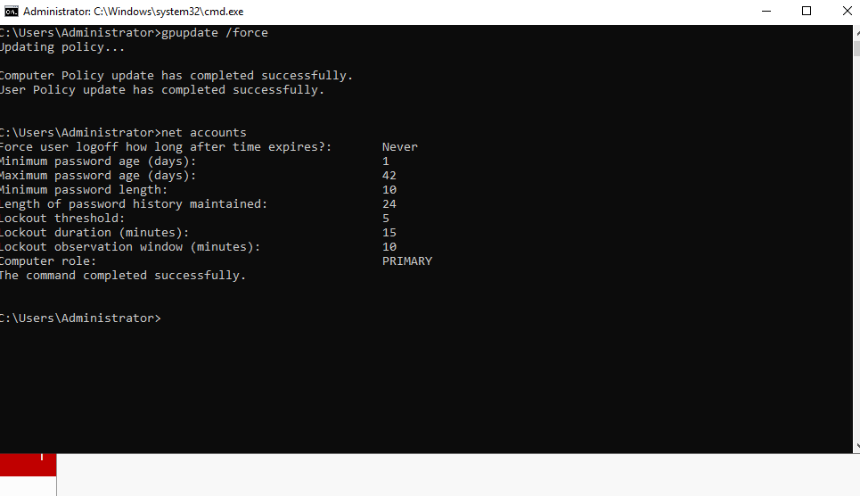
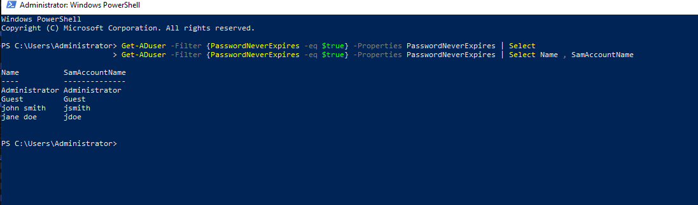
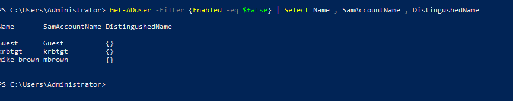
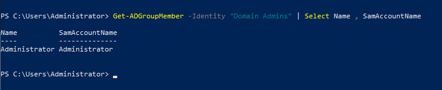
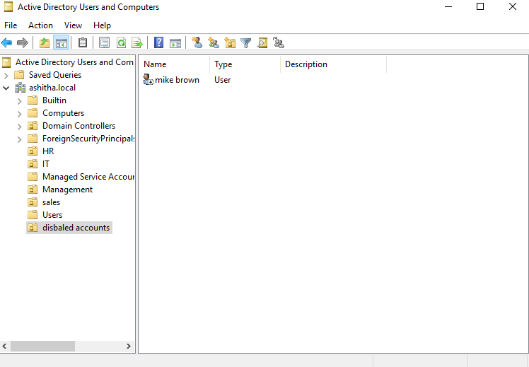

# 06 - AD Security Audit

## What I Built

I performed a security audit of my own Active Directory lab, checking for common misconfigurations that attackers routinely exploit in real environments — weak password policy enforcement, accounts exempt from password expiration, disabled accounts left in active OUs, and unnecessary Domain Admin membership. I documented each finding, its risk, and the remediation applied.

## Audit Areas Covered

1. **Password & lockout policy enforcement** — checked via `net accounts`
2. **Accounts with "Password Never Expires"** — checked via PowerShell (`Get-ADUser -Filter {PasswordNeverExpires -eq $true}`)
3. **Disabled accounts sitting in active OUs** — checked via PowerShell (`Get-ADUser -Filter {Enabled -eq $false}`)
4. **Domain Admins group membership** — checked via PowerShell (`Get-ADGroupMember -Identity "Domain Admins"`)

## Key Finding

The most significant discovery was that a correctly-configured Security Baseline Policy GPO (minimum password length 10, lockout threshold 5) was **not actually being enforced** — `net accounts` showed the domain was still running on weaker defaults (length 7, no lockout). This was traced to GPO link order: Account Policies are only enforced from a single GPO at the domain level based on link precedence, and the built-in Default Domain Policy was overriding the custom policy. Reordering the GPO links fixed the issue, confirmed by re-running `net accounts` after a forced policy update.

This is a good example of why "the GPO is configured" and "the GPO is actually in effect" are two different things worth verifying separately — a lesson directly applicable to real-world AD administration and security auditing.

## Remediation Applied

All identified issues were fixed directly in this lab, not just documented:

1. **GPO link order** — Reordered domain-level GPO links so "Security Baseline Policy" has precedence over "Default Domain Policy." Verified with `gpupdate /force` + `net accounts`, confirming minimum password length now correctly shows 10 and lockout threshold shows 5.
2. **Password Never Expires** — Removed this setting from the two standard user accounts that had it (`jsmith`, `jdoe`) via ADUC. Left it in place for `Administrator` and `Guest`, since this is expected default behavior for built-in accounts, not a misconfiguration.
3. **Disabled account in active OU** — Created a dedicated `Disabled Accounts` OU and moved the disabled `mikebrown` account into it, separating it from active users for cleaner access reviews going forward.
4. **Domain Admins membership** — No remediation needed; membership was already minimal (Administrator only), so this was verified and documented as a passing control.

## Screenshots

### net accounts — After Fix (Correct Policy Enforced)

### Password Never Expires — Accounts Found

### Disabled Users in Active OUs

### Domain Admins Group Membership

### Disabled Account Moved to Dedicated OU

## Skills Demonstrated

- Active Directory security auditing methodology
- Understanding of GPO link order and Account Policy precedence
- PowerShell-based AD querying and filtering (`Get-ADUser`, `Get-ADGroupMember`)
- Identifying and remediating common real-world AD misconfigurations
- Security documentation: findings → risk → remediation format
